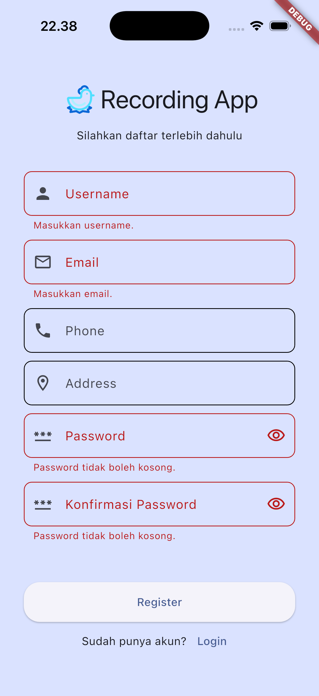
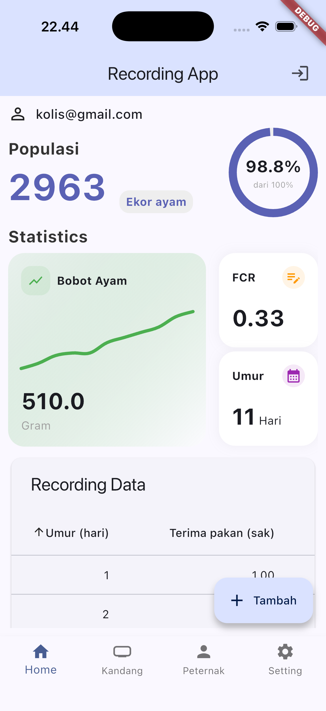
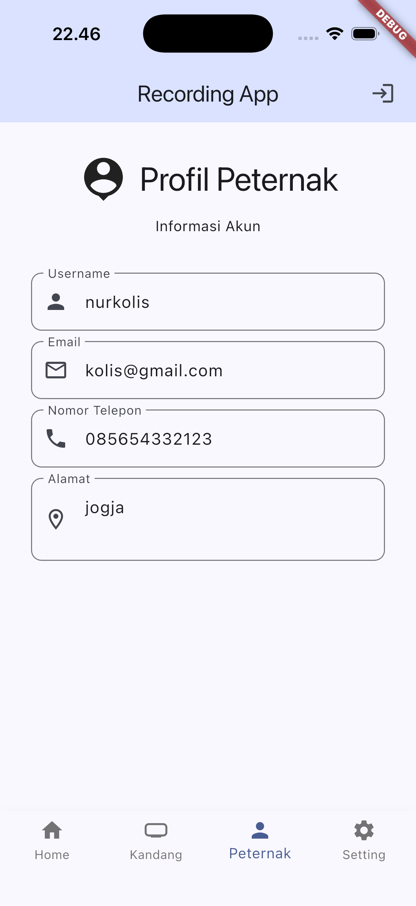
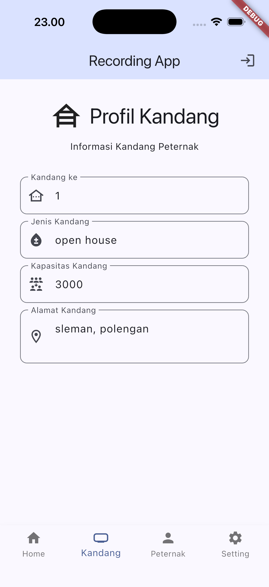
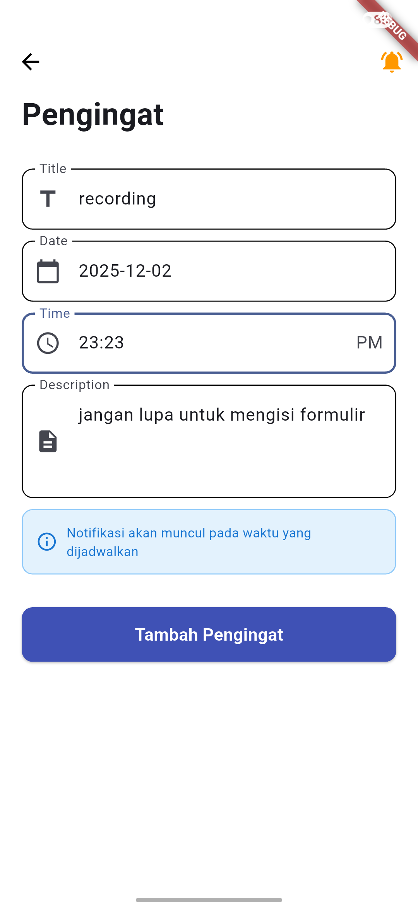
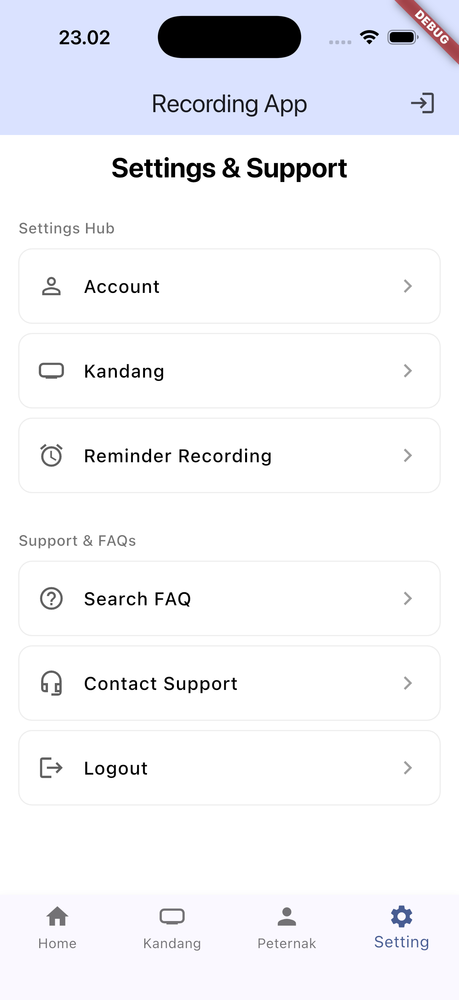

## License

Specify your license here (e.g., MIT, Apache-2.0).

<div align="center">

# Broilerku App

Smart broiler farm assistant for automated FCR calculation, daily monitoring, reminders, and analytics. Built with Flutter using a clean, feature-first architecture.

</div>

---

## Table of Contents

- **Overview**
- **Goals & Problem Solved**
- **Key Features**
- **Tech Stack**
- **Installation**
- **Run the Project**
- **Environment Configuration**
- **Folder Structure**
- **Screenshots**
- **License**

---

## Overview

Broilerku App helps broiler farmers streamline daily operations: recording, automated FCR calculation, trend charts, and reminders for critical tasks. It integrates Firebase for auth/data and supports local storage and notifications for a reliable experience online and offline.

## Goals & Problem Solved

- **Automation calculate FCR**: Reduce manual errors by computing Feed Conversion Ratio directly from recorded data.
- **Monitoring**: Track daily weight, feed intake, and mortality with clear dashboards and charts.
- **Productivity**: Timely reminders for feeding, weighing, and medication schedules.
- **Data integrity**: Sync to Firestore with local storage fallback using Hive.

## Key Features

- **Authentication**: Email/password login via Firebase Auth.
- **Recording & FCR**: Record per-day metrics; app computes FCR per period.
- **Dashboard & Charts**: Visualize growth and performance with `fl_chart`.
- **Reminders**: Local scheduled notifications with timezone support.
- **Cage Management**: Manage cage meta (type, capacity, address).
- **User Profile**: Store and retrieve farmer profile data.
- **Offline-first**: Persist critical state with Hive boxes.

## Tech Stack

- **Framework**: Flutter (Dart >= 3.7.2)
- **State/Storage**: Hive, hive_flutter
- **Backend**: Firebase (Core, Auth, Cloud Firestore)
- **UI/Charts**: fl_chart, flutter_svg, Material 3
- **Notifications**: flutter_local_notifications, timezone, flutter_timezone
- **Platforms**: Android, iOS, Web, macOS

See `pubspec.yaml` for the full dependency list and versions.

## Installation

Prerequisites

- Flutter SDK installed and configured
- Dart >= 3.7.2
- Xcode (iOS) and/or Android Studio (Android)
- A device/emulator

Steps

1. Clone the repo
   ```bash
   git clone <your-repo-url>
   cd chickin-flutter-app
   ```
2. Install dependencies
   ```bash
   flutter pub get
   ```
3. Configure Firebase
   - This project initializes Firebase via `lib/firebase_options.dart` (generated by FlutterFire CLI).
   - If you fork or use your own Firebase project, re-generate options:
     ```bash
     dart pub global activate flutterfire_cli
     flutterfire configure
     ```
   - Ensure your platforms are added during configuration (Android/iOS/Web/macOS).
4. iOS specific
   - Open `ios/Runner/Info.plist` and ensure notification permissions are present (Darwin config handled in code). Example keys if needed:
     ```xml
     <key>UIBackgroundModes</key>
     <array>
       <string>remote-notification</string>
     </array>
     ```
   - Run `pod install` inside `ios` if CocoaPods updates are required.
5. Android specific
   - If using your own Firebase project, ensure the applicationId matches the Firebase app registered in `android/app/build.gradle`.
   - On Android 13+, add POST_NOTIFICATIONS permission in `AndroidManifest.xml` if not already present.

## Run the Project

- Run on a connected device/emulator
  ```bash
  flutter run
  ```

- Run tests
  ```bash
  flutter test
  ```

- Build release
  ```bash
  # Android
  flutter build apk --release
  # iOS (requires codesigning)
  flutter build ios --release
  ```

## Environment Configuration

- The app uses `firebase_options.dart` for Firebase credentials, generated by FlutterFire and checked into the repo.
- If you need additional runtime configuration, you may use a `.env` pattern (via packages like `flutter_dotenv`). Example:
  ```bash
  # .env.example
  API_BASE_URL=https://api.example.com
  SENTRY_DSN=https://public@sentry.io/1
  ```
- For secrets/APIs, never commit actual `.env`; commit `.env.example` and load values securely in CI or local dev.

## Folder Structure

Top-level

```text
.
├─ android/
├─ ios/
├─ lib/
│  ├─ core/
│  │  └─ services/
│  │     ├─ firebase_service.dart
│  │     └─ notification_service.dart
│  ├─ features/
│  │  ├─ auth/
│  │  ├─ cage/
│  │  ├─ dashboard/
│  │  ├─ reminder/
│  │  ├─ setting/
│  │  └─ user/
│  ├─ firebase_options.dart
│  ├─ main.dart
│  └─ main_app.dart
├─ pubspec.yaml
└─ README.md
```

## Screenshots

## Auth



## Main & Farmer



## Cage, Reminder & Settings



