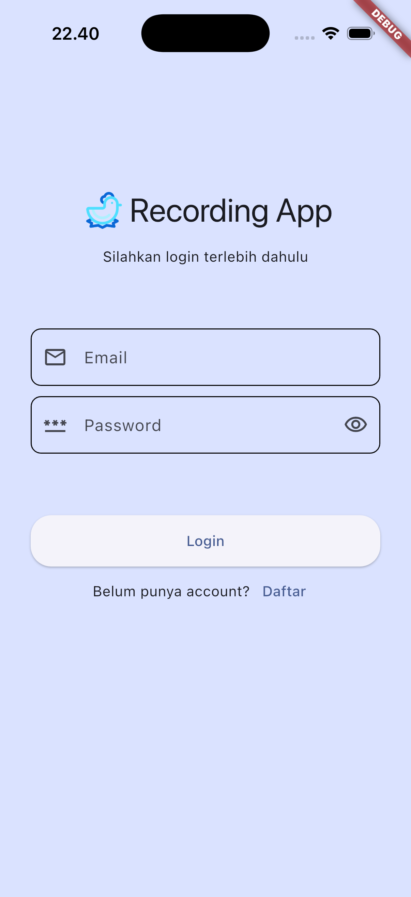

Notes

- **Feature-first**: Each feature encapsulates its data/domain/presentation.
- **Core services**: Cross-cutting services (Firebase, notifications) live under `lib/core/services`.

## Screenshots

Place screenshots under `docs/screenshots` or `images/` and reference them here:

```md


```

## License

Specify your license here (e.g., MIT, Apache-2.0).

<div align="center">

# Broilerku App

Smart broiler farm assistant for automated FCR calculation, daily monitoring, reminders, and analytics. Built with Flutter using a clean, feature-first architecture.

</div>

---

## Table of Contents

- **Overview**
- **Goals & Problem Solved**
- **Key Features**
- **User Stories**
- **Tech Stack**
- **Installation**
- **Run the Project**
- **Environment Configuration**
- **Folder Structure**
- **Screenshots**
- **License**

---

## Overview

Broilerku App helps broiler farmers streamline daily operations: recording, automated FCR calculation, trend charts, and reminders for critical tasks. It integrates Firebase for auth/data and supports local storage and notifications for a reliable experience online and offline.

## Goals & Problem Solved

- **Automation calculate FCR**: Reduce manual errors by computing Feed Conversion Ratio directly from recorded data.
- **Monitoring**: Track daily weight, feed intake, and mortality with clear dashboards and charts.
- **Productivity**: Timely reminders for feeding, weighing, and medication schedules.
- **Data integrity**: Sync to Firestore with local storage fallback using Hive.

## Key Features

- **Authentication**: Email/password login via Firebase Auth.
- **Recording & FCR**: Record per-day metrics; app computes FCR per period.
- **Dashboard & Charts**: Visualize growth and performance with `fl_chart`.
- **Reminders**: Local scheduled notifications with timezone support.
- **Cage Management**: Manage cage meta (type, capacity, address).
- **User Profile**: Store and retrieve farmer profile data.
- **Offline-first**: Persist critical state with Hive boxes.

## User Stories

- **[Authentication - Login/Signup]**
  - As a broiler farmer, I want to sign up and log in with email/password so that I can securely access my farm data.
  - Acceptance:
    - Sign up, login, logout flows work.
    - Invalid credentials show error.
    - Persist session until logout.

- **[Recording - Daily Metrics Entry]**
  - As a farmer, I want to record daily metrics (weight, feed intake, mortality) per period so that I can track flock performance.
  - Acceptance:
    - Create/read/update/delete daily entries.
    - Validation on numeric fields and dates.
    - Entries tied to selected period and user.

- **[FCR - Automatic Calculation]**
  - As a farmer, I want the app to automatically calculate FCR from my data so that I can quickly assess feed efficiency.
  - Acceptance:
    - FCR updates when feed/weight/mortality changes.
    - Displays FCR per day and cumulative per period.
    - Handles missing data with clear warnings.

- **[Dashboard - Trends & Charts]**
  - As a farmer, I want to see trend charts (weight growth, feed consumption, FCR) so that I can spot issues early.
  - Acceptance:
    - Charts render from recorded data using fl_chart.
    - Range filter (period, last 7/14/30 days).
    - Empty state when no data.

- **[Reminders - Scheduled Tasks]**
  - As a farmer, I want reminders for critical tasks (feeding, weighing, medication) so that I don’t miss schedules.
  - Acceptance:
    - Create/read/delete reminders.
    - Local notifications fire at scheduled time with timezone support.
    - Tapping notification opens the app.

- **[Cage Management]**
  - As a farmer, I want to manage cage metadata (type, capacity, address) so that records are tied to proper facilities.
  - Acceptance:
    - View/edit cage profile.
    - Validation on capacity (positive integer).
    - Data stored per user.

- **[User Profile]**
  - As a farmer, I want to manage my profile (username, phone, address) so that my account stays up to date.
  - Acceptance:
    - View/edit profile fields.
    - Changes persist and reflect immediately.
    - Basic validation on phone and address.

- **[Offline-first - Local Persistence]**
  - As a farmer, I want critical data to be available offline so that I can record in areas with poor connectivity.
  - Acceptance:
    - Entries saved locally (Hive) when offline.
    - Auto-sync to Firestore when online.
    - Conflict resolution favors latest change with clear rules.

- **[Security & Data Integrity]**
  - As a farmer, I want my data to be stored securely and scoped to my account so that only I can view and edit it.
  - Acceptance:
    - Firestore security rules restrict data to authenticated user email.
    - No cross-user access.
    - Sensitive operations require authenticated session.

## Tech Stack

- **Framework**: Flutter (Dart >= 3.7.2)
- **State/Storage**: Hive, hive_flutter
- **Backend**: Firebase (Core, Auth, Cloud Firestore)
- **UI/Charts**: fl_chart, flutter_svg, Material 3
- **Notifications**: flutter_local_notifications, timezone, flutter_timezone
- **Platforms**: Android, iOS, Web, macOS

See `pubspec.yaml` for the full dependency list and versions.

## Installation

Prerequisites

- Flutter SDK installed and configured
- Dart >= 3.7.2
- Xcode (iOS) and/or Android Studio (Android)
- A device/emulator

Steps

1. Clone the repo
   ```bash
   git clone <your-repo-url>
   cd chickin-flutter-app
   ```
2. Install dependencies
   ```bash
   flutter pub get
   ```
3. Configure Firebase
   - This project initializes Firebase via `lib/firebase_options.dart` (generated by FlutterFire CLI).
   - If you fork or use your own Firebase project, re-generate options:
     ```bash
     dart pub global activate flutterfire_cli
     flutterfire configure
     ```
   - Ensure your platforms are added during configuration (Android/iOS/Web/macOS).
4. iOS specific
   - Open `ios/Runner/Info.plist` and ensure notification permissions are present (Darwin config handled in code). Example keys if needed:
     ```xml
     <key>UIBackgroundModes</key>
     <array>
       <string>remote-notification</string>
     </array>
     ```
   - Run `pod install` inside `ios` if CocoaPods updates are required.
5. Android specific
   - If using your own Firebase project, ensure the applicationId matches the Firebase app registered in `android/app/build.gradle`.
   - On Android 13+, add POST_NOTIFICATIONS permission in `AndroidManifest.xml` if not already present.

## Run the Project

- Run on a connected device/emulator
  ```bash
  flutter run
  ```

- Run tests
  ```bash
  flutter test
  ```

- Build release
  ```bash
  # Android
  flutter build apk --release
  # iOS (requires codesigning)
  flutter build ios --release
  ```

## Environment Configuration

- The app uses `firebase_options.dart` for Firebase credentials, generated by FlutterFire and checked into the repo.
- If you need additional runtime configuration, you may use a `.env` pattern (via packages like `flutter_dotenv`). Example:
  ```bash
  # .env.example
  API_BASE_URL=https://api.example.com
  SENTRY_DSN=https://public@sentry.io/1
  ```
- For secrets/APIs, never commit actual `.env`; commit `.env.example` and load values securely in CI or local dev.

## Folder Structure

Top-level

```text
.
├─ android/
├─ ios/
├─ lib/
│  ├─ core/
│  │  └─ services/
│  │     ├─ firebase_service.dart
│  │     └─ notification_service.dart
│  ├─ features/
│  │  ├─ auth/
│  │  ├─ cage/
│  │  ├─ dashboard/
│  │  ├─ reminder/
│  │  ├─ setting/
│  │  └─ user/
│  ├─ firebase_options.dart
│  ├─ main.dart
│  └─ main_app.dart
├─ pubspec.yaml
└─ README.md
