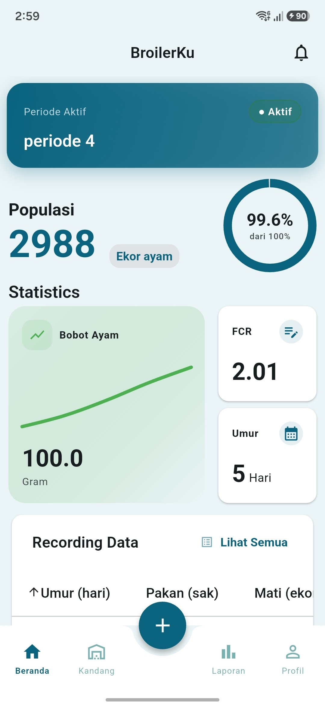
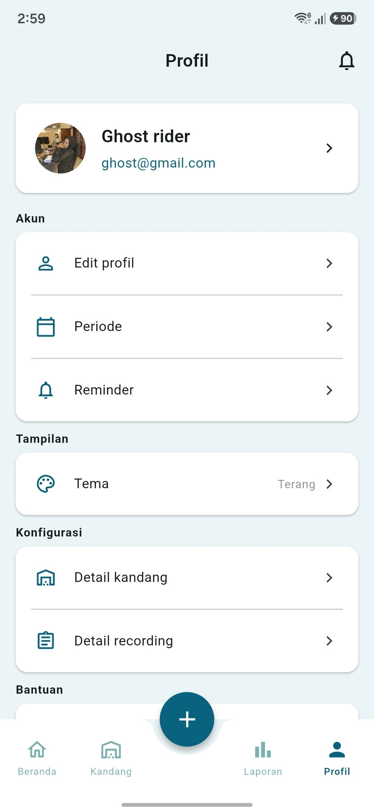
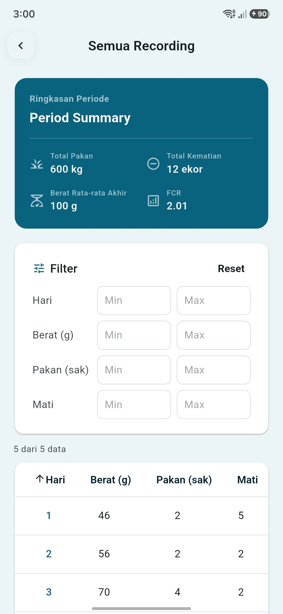
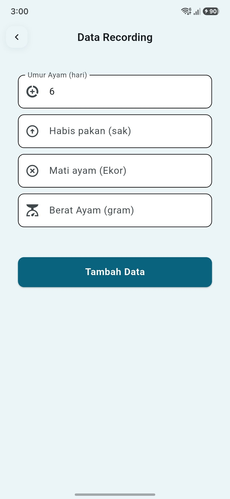
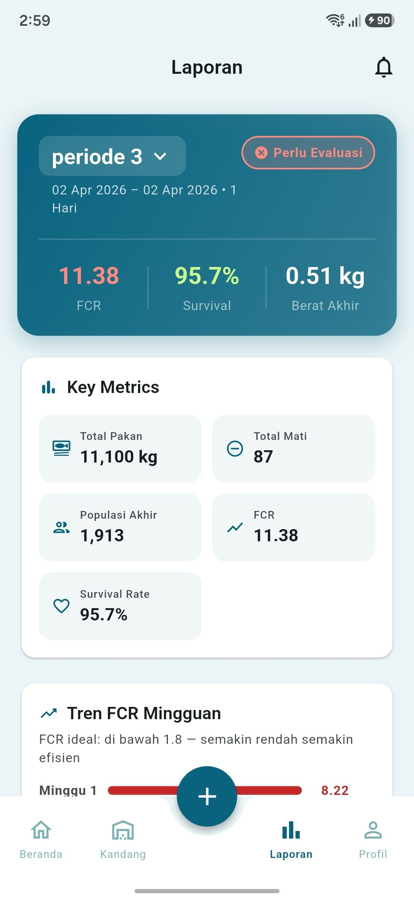
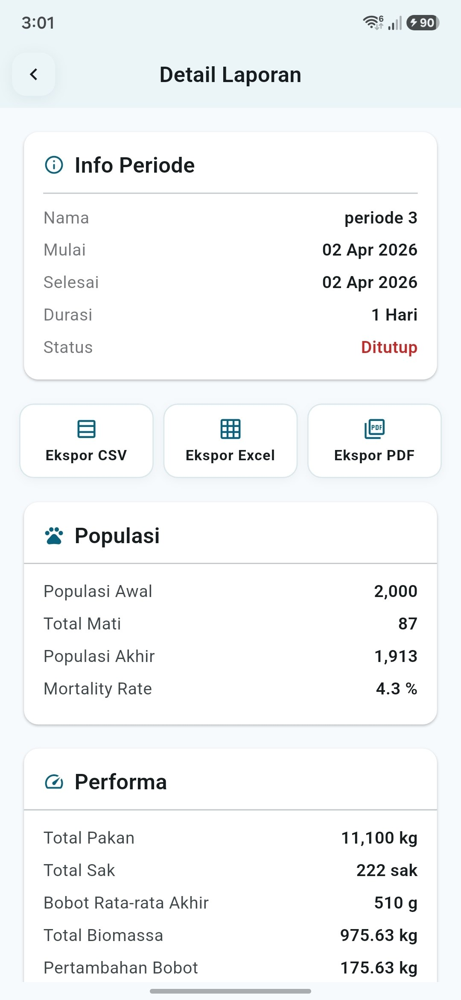

<div align="center">


# BroilerKu

Broiler farm recording app for daily flock data, FCR calculation, period reports, reminders, and farmer profile management.

[](https://flutter.dev)
[](https://dart.dev)
[](https://firebase.google.com)
[](https://pub.dev/packages/provider)

</div>

---

## Overview

BroilerKu helps farmers manage one broiler farming cycle at a time with structured recording instead of paper notes. The app stores user data in Firebase, keeps lightweight local state in Hive, and uses feature-first Flutter modules for maintainable delivery.

Core workflows:

- Register and log in with Firebase Auth.
- Set farmer profile and cage data.
- Create a farming period.
- Record daily average weight, feed usage, and mortality.
- Track population, FCR, weight trend, and performance metrics.
- Generate period reports and export them to CSV or Excel.
- Schedule local reminders for farm activities.

The Flutter package name is still `recording_app`; the installed app name is `BroilerKu`.

## Screenshots

<table>
  <tr>
    <td align="center"><strong>Home</strong></td>
    <td align="center"><strong>Profile</strong></td>
    <td align="center"><strong>Recording</strong></td>
  </tr>
  <tr>
    <td></td>
    <td></td>
    <td></td>
  </tr>
  <tr>
    <td align="center"><strong>Recording Input</strong></td>
    <td align="center"><strong>Report</strong></td>
    <td align="center"><strong>Report Detail</strong></td>
  </tr>
  <tr>
    <td></td>
    <td></td>
    <td></td>
  </tr>
</table>

## Features

| Feature | Details |
|---|---|
| Authentication | Email/password sign up, login, logout, and reset password through Firebase Auth. |
| Farmer profile | Farmer name, phone, address, and profile photo upload. |
| Cage profile | Cage type, capacity, location, and cage image upload. |
| Period management | Create, close, delete, and review broiler farming periods. |
| Daily recording | Record day number, average weight in grams, feed sacks, and mortality. |
| FCR calculation | Calculates feed conversion ratio from current period recording data. |
| Dashboard | Shows active period stats, population, FCR, and latest recordings. |
| Reporting | Builds realtime and closed-period reports with summaries, analytics, insights, and charts. |
| Export | Exports period reports to CSV and Excel, then shares them through `share_plus`. |
| Reminders | Local reminders backed by `flutter_local_notifications` and local Hive storage. |
| Onboarding | First-run onboarding and guided app tour state. |
| Theme | Light and dark theme support through `ThemeController`. |

## Tech Stack

| Area | Tooling |
|---|---|
| App | Flutter, Dart SDK `^3.7.2` |
| State management | Provider, `ChangeNotifier`, `ChangeNotifierProxyProvider` |
| Backend | Firebase Core, Firebase Auth, Cloud Firestore, Firebase App Check |
| Local storage | Hive, Hive Flutter |
| Media upload | Cloudinary via `StorageService` |
| Notifications | `flutter_local_notifications`, `timezone`, `flutter_timezone` |
| Charts | `fl_chart` |
| Export/share | `csv`, `excel`, `path_provider`, `share_plus` |
| Forms/media | `image_picker`, `image_cropper`, `easy_date_timeline`, `intl` |
| App assets | `flutter_launcher_icons`, `flutter_native_splash`, `flutter_svg` |
| Quality | `flutter_lints`, unit/widget tests under `test/` |

## Project Structure

```text
lib/
|-- main.dart                         # Firebase, App Check, notifications, Hive init
|-- main_app.dart                     # MultiProvider and MaterialApp root
|-- app_checker.dart                  # Startup routing
|-- firebase_options.dart             # Firebase options loaded from assets/env
|-- core/
|   |-- auth/                         # AuthService and auth wrapper
|   |-- components/                   # Shared UI components
|   |-- models/                       # Safe conversion helpers
|   |-- services/                     # Firebase, notification, reminder, storage services
|   |-- theme/                        # Colors, typography, app themes, theme controller
|   |-- transitions/
|   `-- utils/
`-- features/
    |-- auth/                         # Login and signup
    |-- cage/                         # Cage model, controller, screens, widgets
    |-- dashboard/                    # Home dashboard and dashboard widgets
    |-- export/                       # CSV and Excel exporters
    |-- onboarding/                   # Onboarding screens and data
    |-- period/                       # Period model, controller, list/form screens
    |-- recording/                    # Recording model, FCR use case, record screens
    |-- reminder/                     # Reminder model and screens
    |-- reporting/                    # Report calculators, controller, report UI
    `-- user/                         # User profile model, controller, profile screens
```

## Architecture Rules

This project uses a feature-first structure with simple service gateways.

- Keep feature logic inside `lib/features/<feature>` unless it is genuinely reused.
- Use `FirebaseService` as the Firestore gateway. Do not call `FirebaseFirestore.instance` from widgets or controllers.
- Use `AuthService` as the Firebase Auth gateway.
- Use Provider controllers for screen state and auth-reactive loading.
- Use `DialogHelper` for confirmation and error dialogs.
- Use `safe_convert.dart` helpers in model `fromJson` methods.
- Keep shared modules concrete and small. Do not add interfaces without a current need.

## Setup

### Requirements

- Flutter SDK compatible with Dart `^3.7.2`
- Android Studio or Xcode, depending on target platform
- Firebase project with Auth, Firestore, and App Check configured
- Cloudinary cloud name for image upload

### Install

```bash
git clone <repo-url>
cd chickin-flutter-app
flutter pub get
```

Create the runtime env asset:

```bash
cp .env.example assets/env
```

Fill `assets/env` with Firebase, App Check, and Cloudinary values. This file is intentionally ignored by Git and is loaded in `lib/main.dart` with:

```dart
await dotenv.load(fileName: 'assets/env');
```

For iOS, install pods after dependencies are ready:

```bash
cd ios
pod install
cd ..
```

## Environment Variables

```env
# Web
FIREBASE_WEB_API_KEY=
FIREBASE_WEB_APP_ID=
FIREBASE_WEB_MESSAGING_SENDER_ID=
FIREBASE_WEB_PROJECT_ID=
FIREBASE_WEB_AUTH_DOMAIN=
FIREBASE_WEB_STORAGE_BUCKET=
FIREBASE_WEB_MEASUREMENT_ID=

# Android
FIREBASE_ANDROID_API_KEY=
FIREBASE_ANDROID_APP_ID=
FIREBASE_ANDROID_MESSAGING_SENDER_ID=
FIREBASE_ANDROID_PROJECT_ID=
FIREBASE_ANDROID_STORAGE_BUCKET=

# iOS and macOS
FIREBASE_IOS_API_KEY=
FIREBASE_IOS_APP_ID=
FIREBASE_IOS_MESSAGING_SENDER_ID=
FIREBASE_IOS_PROJECT_ID=
FIREBASE_IOS_STORAGE_BUCKET=
FIREBASE_IOS_BUNDLE_ID=

# Firebase App Check web provider
RECAPTCHA_ENTERPRISE_SITE_KEY=

# Cloudinary image upload
CLOUDINARY_CLOUD_NAME=
```

## Firebase Setup

1. Create a Firebase project.
2. Enable Email/Password sign-in in Firebase Authentication.
3. Create Cloud Firestore.
4. Register Android app `com.chickin.mobile`.
5. Register iOS app `com.chickin.mobile`.
6. Configure Firebase App Check:
   - Android debug uses debug provider.
   - Android release uses Play Integrity.
   - Apple debug uses debug provider.
   - Apple release uses DeviceCheck.
   - Web uses reCAPTCHA Enterprise when `RECAPTCHA_ENTERPRISE_SITE_KEY` is present.
7. Generate or update `lib/firebase_options.dart` if Firebase app IDs change:

```bash
dart pub global activate flutterfire_cli
flutterfire configure
```

Deploy Firestore rules:

```bash
firebase deploy --only firestore:rules
```

## Run

```bash
flutter run
flutter run -d <device-id>
flutter run --release
```

Makefile shortcuts are available:

```bash
make run
make run-a
make run-i
make run-web
make run-macos
```

## Test And Quality

```bash
flutter analyze
flutter test
dart format lib test
```

Makefile shortcuts:

```bash
make analyze
make test
make lint
```

On Unix/macOS, `make test` runs `scripts/test_report.sh`.

## Build

```bash
# Android APK
flutter build apk --release

# Android App Bundle
flutter build appbundle --release

# iOS
flutter build ios --release

# Web
flutter build web --release
```

Makefile shortcuts:

```bash
make build-apk
make build-aab
make build-ios
make build-web
```

Regenerate launcher icons and splash assets:

```bash
dart run flutter_launcher_icons
dart run flutter_native_splash:create
```

## Data Model

Firestore data is scoped per user.

```text
users/{uid}
|-- profile: { name, phone, address, hasCompletedTour, avatarUrl? }
|-- cage: { type, capacity, location, imageUrl? }
`-- createdAt

users/{uid}/periods/{periodId}
|-- name
|-- initialCapacity
|-- initialWeight
|-- startDate
|-- endDate?
|-- isActive
|-- isDeleted
|-- createdAt
`-- summary?

users/{uid}/periods/{periodId}/recordings/{recordingId}
|-- day
|-- avgWeightGram
|-- feedSack
|-- mortality
`-- createdAt

users/{uid}/reminders/{reminderId}
|-- title
|-- date
|-- time
|-- description
|-- createdAt
`-- updatedAt
```

Security rules live in `firestore.rules`.

## Release Notes

- App display name: `BroilerKu`
- Android application ID: `com.chickin.mobile`
- iOS bundle identifier: `com.chickin.mobile`
- Version is managed in `pubspec.yaml`
- Store listing draft is in `docs/store_listing.md`
- Privacy policy page is in `web/privacy-policy.html`
