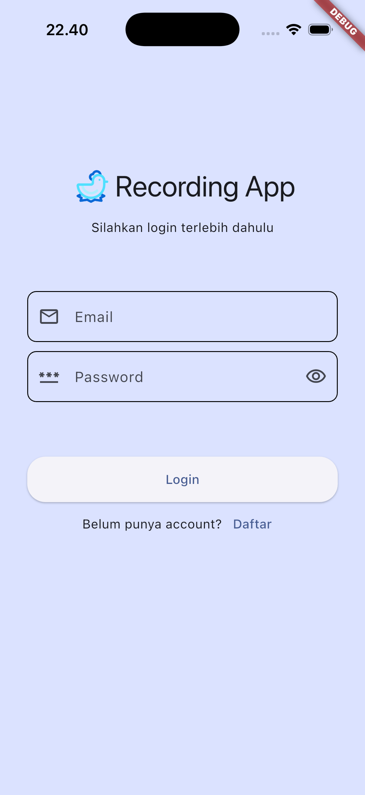
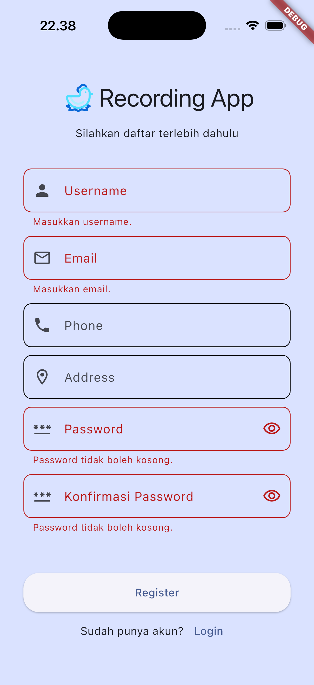
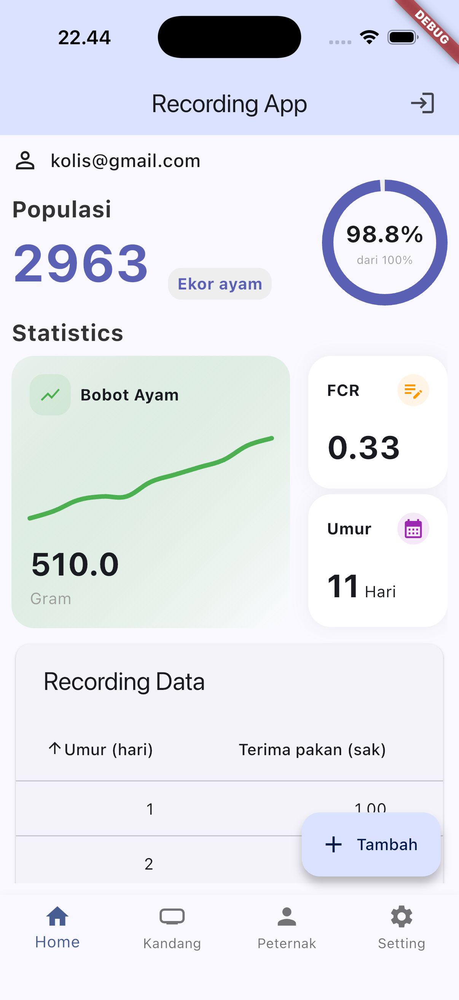
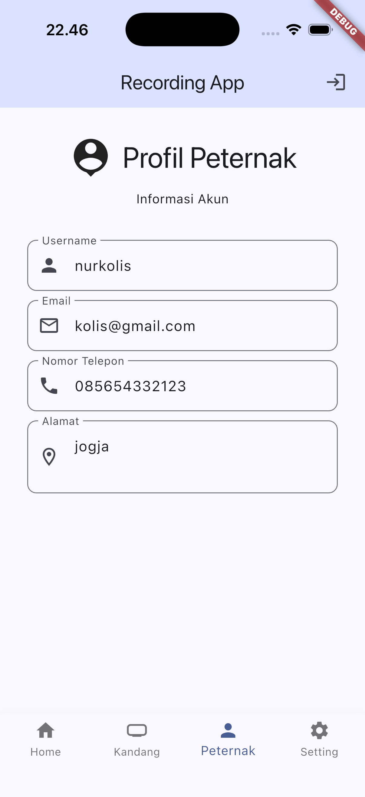
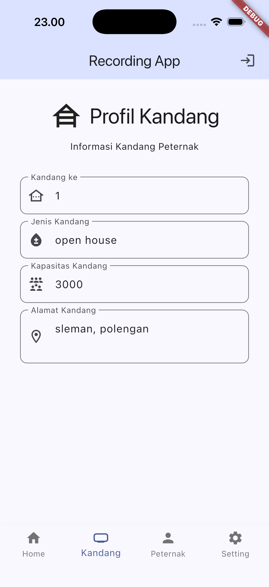
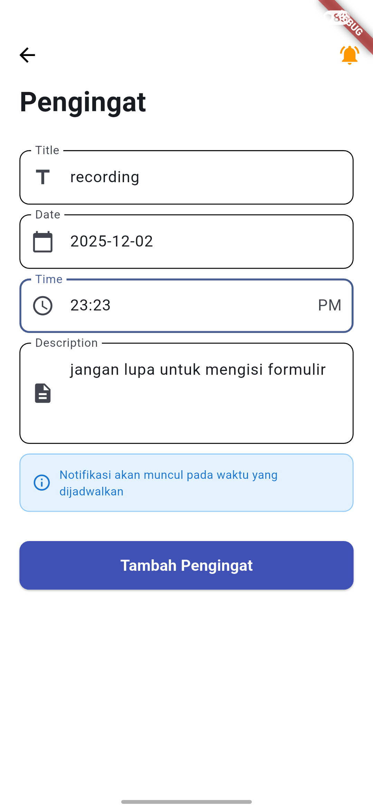
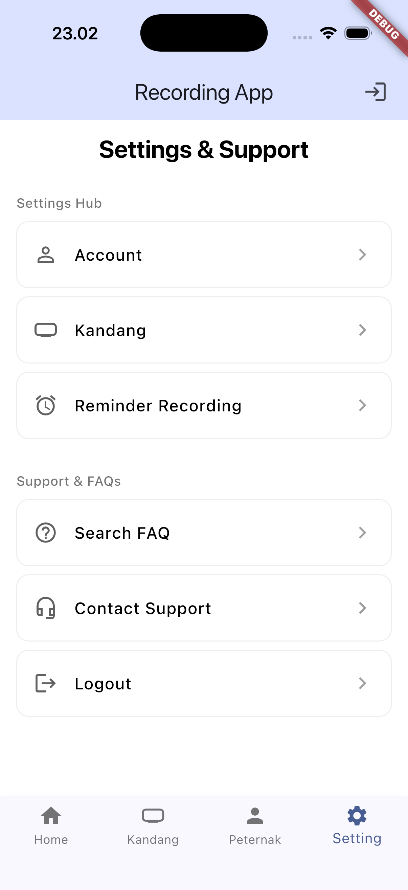

<div align="center">


# Chickin — Aplikasi Manajemen Peternakan Ayam

Smart broiler farm assistant for automated FCR calculation, daily monitoring, reminders, and analytics.
Built with Flutter using a clean, feature-first architecture.

[](https://flutter.dev)
[](https://dart.dev)
[](https://firebase.google.com)
[](LICENSE)

</div>

---

## Table of Contents

1. [Project Overview](#1-project-overview)
2. [Features](#2-features)
3. [Screenshots](#3-screenshots)
4. [Tech Stack](#4-tech-stack)
5. [Architecture](#5-architecture)
6. [Folder Structure](#6-folder-structure)
7. [Installation](#7-installation)
8. [Environment Variables](#8-environment-variables)
9. [Firebase Setup](#9-firebase-setup)
10. [Running the App](#10-running-the-app)
11. [Build Release](#11-build-release)
12. [Project Configuration](#12-project-configuration)
13. [Coding Standards](#13-coding-standards)
14. [State Management](#14-state-management)
15. [Database Structure](#15-database-structure)
16. [Release Workflow](#16-release-workflow)
17. [CI/CD](#17-cicd)
18. [Roadmap](#18-roadmap)
19. [Contributing](#19-contributing)
20. [License](#20-license)

---

## 1. Project Overview

**Chickin** helps broiler farmers streamline daily operations:

- Record daily metrics (weight, feed, mortality) per farming period
- Automated FCR (Feed Conversion Ratio) calculation from raw data
- Visualize growth trends with charts and performance analytics
- Export reports to CSV and Excel
- Local push notifications for feeding and medication reminders
- Guided onboarding tour for first-time users

The app works primarily online via Firebase Firestore, with local state persistence using Hive as fallback. Target platform is Android and iOS.

---

## 2. Features

| Feature | Description |
|---|---|
| **Authentication** | Email/password login and registration via Firebase Auth |
| **Onboarding** | Single-use guided tour shown on first launch |
| **Dashboard** | Active period summary — population, mortality, FCR stats, recording table |
| **Cage Management** | CRUD kandang: type, capacity, location, photo |
| **Period Management** | Create, close, and delete farming periods (one active at a time) |
| **Daily Recording** | Input per-day: avg weight (gram), feed sacks, mortality |
| **FCR Calculation** | Automatic FCR computed via `CalculateFCR` use case per period |
| **Reporting** | Period reports: summary, analytics, insights, FCR trend chart |
| **Export** | Export period data to CSV and Excel, shareable via `share_plus` |
| **Reminders** | Scheduled local notifications (feeding, medication, weighing) |
| **User Profile** | Store farmer name, phone, address, avatar photo |
| **Guided Tour** | Step-by-step tour overlay on first login |

---

## 3. Screenshots

### Auth
 

### Dashboard & Farmer Profile
 

### Cage, Reminder & Settings
  

---

## 4. Tech Stack

| Layer | Package / Tool | Version |
|---|---|---|
| Framework | Flutter (Dart) | `≥ 3.7.2` |
| State Management | Provider + ChangeNotifier | `^6.1.5+1` |
| Backend | Firebase Core | `^3.15.0` |
| Auth | Firebase Auth | `^5.6.1` |
| Database | Cloud Firestore | `^5.6.10` |
| Local Storage | Hive + hive_flutter | `^2.2.3` / `^1.1.0` |
| Charts | fl_chart | `^1.0.0` |
| Notifications | flutter_local_notifications | `^17.2.3` |
| Timezone | timezone + flutter_timezone | `^0.9.4` / `^3.0.1` |
| Image | image_picker + image_cropper | `^1.1.2` / `^8.0.0` |
| Firebase Storage | (via `StorageService`) | — |
| Export | csv + excel | `^6.0.0` / `^4.0.6` |
| Share | share_plus | `^10.1.4` |
| Env | flutter_dotenv | `^5.2.1` |
| HTTP | http | `^1.2.1` |
| Date UI | easy_date_timeline | `^2.0.9` |
| i18n | intl | `^0.20.2` |
| Loading | shimmer | `^3.0.0` |
| SVG | flutter_svg | `^2.1.0` |
| Code Gen | build_runner + hive_generator | — |
| Launcher Icons | flutter_launcher_icons | `^0.14.4` |
| Splash Screen | flutter_native_splash | `^2.4.4` |

---

## 5. Architecture

The project follows **Feature-First Clean Architecture** adapted for a Provider-based Flutter app.

```
┌─────────────────────────────────────────────────────────────┐
│                        Presentation                         │
│  Pages  ──▶  Widgets  ──▶  Controllers (ChangeNotifier)     │
└────────────────────────┬────────────────────────────────────┘
                         │ calls
┌────────────────────────▼────────────────────────────────────┐
│                         Domain                              │
│              Use Cases (business logic)                     │
└────────────────────────┬────────────────────────────────────┘
                         │ calls
┌────────────────────────▼────────────────────────────────────┐
│                          Data                               │
│   Models ──▶ FirebaseService (single Firestore gateway)     │
└─────────────────────────────────────────────────────────────┘
```

**Key architectural rules:**

- `FirebaseService` is the **single gateway** to Firestore. No widget or controller accesses `FirebaseFirestore.instance` directly.
- `AuthService` is the **single gateway** to Firebase Auth.
- All controllers are `ChangeNotifier` and registered via `ChangeNotifierProxyProvider` that reacts to auth state changes.
- All dialogs are called via `DialogHelper` — never `showDialog()` directly from a screen.
- Routing uses Navigator 2.0 (push/pop), guarded by `AuthWrapper`.

---

## 6. Folder Structure

```
lib/
├── main.dart
├── main_app.dart                     ← MultiProvider root + MaterialApp
├── app_checker.dart                  ← entry routing: auth check → onboarding/home
├── firebase_options.dart
│
├── core/
│   ├── auth/
│   │   ├── auth_service.dart         ← ChangeNotifier — login/logout/register
│   │   └── auth_wrapper.dart         ← route guard based on auth state
│   ├── components/
│   │   ├── buttons/
│   │   ├── dialogs/
│   │   │   ├── dialog_helper.dart    ← ENTRY POINT for all dialogs
│   │   │   ├── confirm_dialog.dart
│   │   │   ├── error_dialog.dart
│   │   │   ├── period_picker_dialog.dart
│   │   │   └── string_picker_dialog.dart
│   │   ├── forms/
│   │   ├── header/
│   │   └── snackbars/
│   ├── models/
│   │   └── safe_convert.dart         ← asString, asInt, asDouble, asBool helpers
│   ├── services/
│   │   ├── firebase_service.dart     ← single source for all Firestore operations
│   │   ├── notification_service.dart ← FCM + local notification setup
│   │   ├── reminder_local_service.dart
│   │   └── storage_service.dart      ← Firebase Storage (image upload)
│   ├── theme/
│   │   ├── app_colors.dart           ← all color tokens
│   │   ├── app_text_theme.dart
│   │   └── app_theme.dart            ← ThemeData light + dark
│   ├── tour/
│   │   ├── tour_controller.dart
│   │   ├── tour_step.dart
│   │   └── widgets/
│   ├── transitions/
│   │   └── slide_fade_transition_builder.dart
│   └── utils/
│       └── image_picker_helper.dart
│
├── features/
│   ├── auth/presentation/
│   │   ├── login.dart
│   │   └── signup.dart
│   ├── cage/
│   │   ├── data/models/cage_data.dart
│   │   └── presentation/
│   │       ├── controllers/cage_controller.dart
│   │       └── pages/
│   ├── dashboard/
│   │   └── presentation/
│   │       ├── controllers/home_controller.dart
│   │       ├── dashboard.dart
│   │       └── widgets/
│   ├── export/
│   │   ├── data/exporters/          ← csv_exporter, excel_exporter
│   │   └── domain/usecases/
│   ├── onboarding/
│   ├── period/
│   │   ├── data/models/period_data.dart   ← PeriodData + PeriodSummary + WeeklyFCR
│   │   └── presentation/
│   │       ├── controllers/period_controller.dart
│   │       └── list_period.dart
│   ├── recording/
│   │   ├── data/models/
│   │   │   ├── fcr_data.dart
│   │   │   └── recording_data.dart
│   │   ├── domain/usecases/calculate_fcr.dart
│   │   └── presentation/
│   │       ├── controllers/recording_controller.dart
│   │       └── pages/
│   ├── reminder/
│   ├── reporting/
│   │   ├── domain/usecases/         ← analytics_calculator, summary_calculator, etc.
│   │   └── presentation/
│   │       ├── controllers/reporting_controller.dart
│   │       └── pages/
│   └── user/
│       ├── data/models/user_data.dart     ← UserProfile model
│       └── presentation/
│           ├── controllers/user_controller.dart
│           └── pages/
```

---

## 7. Installation

### Prerequisites

- [Flutter SDK](https://flutter.dev/docs/get-started/install) installed and on PATH (use [FVM](https://fvm.app) recommended)
- Dart `≥ 3.7.2`
- Xcode (for iOS) or Android Studio (for Android)
- A Firebase project (see [Firebase Setup](#9-firebase-setup))

### Steps

```bash
# 1. Clone the repo
git clone <your-repo-url>
cd chickin-flutter-app

# 2. Install dependencies
flutter pub get
# or if using FVM
fvm flutter pub get

# 3. Copy and fill in the env file
cp .env.example .env
# Edit .env with your Firebase credentials

# 4. (iOS only) Install CocoaPods
cd ios && pod install && cd ..
```

---

## 8. Environment Variables

Copy `.env.example` to `.env` and populate all values before running the app.

```bash
# Web
FIREBASE_WEB_API_KEY=
FIREBASE_WEB_APP_ID=
FIREBASE_WEB_MESSAGING_SENDER_ID=
FIREBASE_WEB_PROJECT_ID=
FIREBASE_WEB_AUTH_DOMAIN=
FIREBASE_WEB_STORAGE_BUCKET=
FIREBASE_WEB_MEASUREMENT_ID=

# Android
FIREBASE_ANDROID_API_KEY=
FIREBASE_ANDROID_APP_ID=
FIREBASE_ANDROID_MESSAGING_SENDER_ID=
FIREBASE_ANDROID_PROJECT_ID=
FIREBASE_ANDROID_STORAGE_BUCKET=

# iOS & macOS
FIREBASE_IOS_API_KEY=
FIREBASE_IOS_APP_ID=
FIREBASE_IOS_MESSAGING_SENDER_ID=
FIREBASE_IOS_PROJECT_ID=
FIREBASE_IOS_STORAGE_BUCKET=
FIREBASE_IOS_BUNDLE_ID=
```

> **Never commit `.env` to version control.** It is listed in `.gitignore`. Only `.env.example` is committed.

The `.env` file is bundled as a Flutter asset (declared in `pubspec.yaml`) and loaded at startup via `flutter_dotenv`. Firebase credentials are consumed in `firebase_options.dart`.

---

## 9. Firebase Setup

1. Go to the [Firebase Console](https://console.firebase.google.com) and create a project.

2. Enable the following services:
   - **Authentication** → Email/Password provider
   - **Cloud Firestore** → Start in production mode, then apply rules from `firestore.rules`
   - **Firebase Storage** → For profile and cage photos

3. Register your apps (Android + iOS) in the project settings.

4. Generate `firebase_options.dart` using the FlutterFire CLI:
   ```bash
   dart pub global activate flutterfire_cli
   flutterfire configure
   ```
   This auto-generates `lib/firebase_options.dart` for all platforms.

5. Apply Firestore security rules:
   ```bash
   firebase deploy --only firestore:rules
   ```

6. **Android:** Ensure the `applicationId` in `android/app/build.gradle` matches the app registered in Firebase.

7. **iOS (Android 13+):** Notification permission is handled in code. No extra `Info.plist` entries are required unless you need background remote-notification modes.

---

## 10. Running the App

Using Flutter directly:

```bash
flutter run                        # debug mode, auto-select device
flutter run -d <device-id>         # specific device
flutter run --release              # release mode
```

Using `make` (recommended):

```bash
make run          # debug on auto-selected device
make run-a        # Android
make run-i        # iOS
make run-web      # Chrome
make run-macos    # macOS
```

Run tests:

```bash
flutter test
# or
make test
```

---

## 11. Build Release

```bash
# Android APK
flutter build apk --release
# Output: build/app/outputs/flutter-apk/app-release.apk

# Android App Bundle (Play Store)
flutter build appbundle --release
# Output: build/app/outputs/bundle/release/app-release.aab

# iOS (requires Xcode code signing configured)
flutter build ios --release
```

Using `make`:

```bash
make build-apk    # APK release
make build-aab    # App Bundle
make build-ios    # iOS release
```

---

## 12. Project Configuration

| File | Purpose |
|---|---|
| `pubspec.yaml` | Dependencies, assets, launcher icons, splash config |
| `analysis_options.yaml` | Lint rules (`flutter_lints`) |
| `Makefile` | Shortcut commands for setup, run, build, test, lint |
| `firebase.json` | Firebase project config (hosting, Firestore rules target) |
| `firestore.rules` | Firestore security rules |
| `.env` / `.env.example` | Runtime Firebase credentials (not committed) |
| `flutter_launcher_icons` | Configured in `pubspec.yaml` — icon path: `assets/icon/app_icon.png` |
| `flutter_native_splash` | Splash bg color `#EBF4F6`, logo `assets/splash/splash_logo.png` |

To regenerate launcher icons or splash:

```bash
dart run flutter_launcher_icons
dart run flutter_native_splash:create
```

---

## 13. Coding Standards

All contributors must follow these rules — they are enforced via code review:

1. **Colors**: Always use `AppColors.*` tokens. No inline hex strings in widgets.
2. **Theme colors**: `colorScheme.surface`, `colorScheme.onBackground`, etc. — use `Theme.of(context).colorScheme.*`.
3. **Text styles**: Always use `Theme.of(context).textTheme.*`. No inline `TextStyle(...)` in widgets.
4. **Firestore access**: Only through `FirebaseService`. No `FirebaseFirestore.instance` outside that class.
5. **Auth access**: Only through `AuthService`. No `FirebaseAuth.instance` in controllers or widgets.
6. **Screen states**: Every screen must handle: `loading`, `data`, `error`. List screens must also have `empty` state.
7. **Destructive actions**: Delete, close period, logout — always confirm via `DialogHelper.showConfirm()` first.
8. **Dialogs**: Never call `showDialog()` or `showModalBottomSheet()` directly from a screen. Always use `DialogHelper`.
9. **Controllers**: Must not import `package:flutter`. Use `foundation.dart` for `ChangeNotifier`.
10. **fromJson**: Use `safe_convert.dart` helpers (`asString`, `asInt`, `asDouble`, `asBool`). Always handle `json == null` — return a default object, never throw.
11. **Business rules**:
    - Only one active period (`isActive: true`) per user at a time.
    - One recording per day per period — validate before submit.

---

## 14. State Management

The app uses **Provider** with `ChangeNotifier` and `ChangeNotifierProxyProvider`.

### Pattern

Every feature controller follows this registration pattern in `MainApp`:

```dart
ChangeNotifierProxyProvider<AuthService, XxxController>(
  create: (_) => XxxController(firebaseService: FirebaseService()),
  update: (_, auth, controller) {
    controller!.onAuthChanged(auth.currentUid);
    return controller;
  },
),
```

`onAuthChanged(String? uid)` is called automatically on every auth state change.
- When `uid != null` → load data for the current user.
- When `uid == null` (logout) → clear local state.

### Registered Controllers

| Controller | Depends On |
|---|---|
| `AuthService` | — (root provider) |
| `UserController` | `AuthService` |
| `CageController` | `AuthService` |
| `HomeController` | `AuthService` |
| `PeriodController` | `AuthService` |
| `RecordingController` | `AuthService` |
| `ReportingController` | `AuthService` |
| `TourController` | `AuthService` |

### Auth Flow

```
App launch
  → AppChecker
    → AuthWrapper
      → isInitialized = false  →  LoadingSpinner
      → isLoggedIn   = false   →  Login / Onboarding
      → isLoggedIn   = true    →  Dashboard / MainScreen
```

---

## 15. Database Structure

All user data lives under `users/{uid}` in Firestore.

```
users/{uid}
  ├── profile: { name, phone, address, hasCompletedTour, avatarUrl? }
  ├── cage:    { type, capacity, location, imageUrl? }
  └── createdAt: Timestamp

users/{uid}/periods/{periodId}
  ├── name: String
  ├── initialCapacity: int
  ├── initialWeight: double        (default: 0.4 kg)
  ├── startDate: Timestamp
  ├── endDate: Timestamp?
  ├── isActive: bool
  ├── isDeleted: bool
  ├── createdAt: Timestamp
  └── summary: {                   (only present when period is closed)
        totalFeedKg: double
        finalPopulation: int
        totalMortality: int
        finalBiomass: double
        finalFCR: double
        avgDailyGain: double
        weeklyFCR: [ { week: int, fcr: double } ]
        insights: [ String ]
      }

users/{uid}/periods/{periodId}/recordings/{recordingId}
  ├── day: int
  ├── avgWeightGram: int
  ├── feedSack: int
  ├── mortality: int
  └── createdAt: Timestamp

users/{uid}/reminders/{reminderId}
  ├── title: String
  ├── date: String
  ├── time: String
  ├── description: String
  ├── createdAt: String
  └── updatedAt: String
```

### Models

| Model | Location |
|---|---|
| `UserProfile` | `features/user/data/models/user_data.dart` |
| `CageData` | `features/cage/data/models/cage_data.dart` |
| `PeriodData` + `PeriodSummary` | `features/period/data/models/period_data.dart` |
| `RecordingData` | `features/recording/data/models/recording_data.dart` |
| `ReminderData` | `features/reminder/data/models/reminder_data.dart` |

---

## 16. Release Workflow

1. **Bump version** in `pubspec.yaml` — follow `semver`:
   ```yaml
   version: 1.2.0+5   # versionName+versionCode
   ```

2. **Clean and build:**
   ```bash
   make fresh         # clean + pub get
   make build-aab     # Android App Bundle for Play Store
   make build-ios     # iOS for App Store
   ```

3. **Android:**
   - Sign the AAB with your release keystore (configure `android/key.properties`).
   - Upload to Google Play Console → Internal Testing → Promote to Production.

4. **iOS:**
   - Archive via Xcode → Organizer → Distribute App.
   - Upload to App Store Connect → TestFlight → Submit for Review.

5. **Tag the release:**
   ```bash
   git tag v1.2.0
   git push origin v1.2.0
   ```

---

## 17. CI/CD

> CI/CD is not yet configured. The following is the recommended setup.

**Recommended: GitHub Actions**

Suggested pipeline stages:

```yaml
# .github/workflows/flutter.yml (example)
on:
  push:
    branches: [main, develop]
  pull_request:

jobs:
  analyze:
    runs-on: ubuntu-latest
    steps:
      - uses: actions/checkout@v4
      - uses: subosito/flutter-action@v2
      - run: flutter pub get
      - run: flutter analyze
      - run: flutter test

  build-android:
    needs: analyze
    runs-on: ubuntu-latest
    steps:
      - run: flutter build apk --release
```

Secrets to configure in GitHub:
- `FIREBASE_ANDROID_API_KEY`, `FIREBASE_IOS_API_KEY`, etc. (mirror `.env.example`)
- Android keystore file and signing credentials

---

## 18. Roadmap

### In Progress
- [ ] Shimmer loading state on all list screens
- [ ] Consistent empty state on all list screens
- [ ] Consistent error state on all screens

### Planned
- [ ] Pull-to-refresh on relevant list screens
- [ ] Profile photo upload via Firebase Storage
- [ ] Cage photo upload via Firebase Storage
- [ ] Push notifications via FCM (service already wired, not yet integrated)
- [ ] Export to PDF (currently CSV and Excel only)
- [ ] Recording list pagination for large datasets
- [ ] More comprehensive per-feature onboarding tour
- [ ] Stricter form validation (duplicate day in recording)
- [ ] Unit tests for domain use cases (`calculate_fcr`, `summary_calculator`, etc.)

---

## 19. Contributing

1. **Fork** the repo and create a branch from `main`:
   ```bash
   git checkout -b feat/your-feature-name
   ```

2. Follow the [Coding Standards](#13-coding-standards) section strictly.

3. Write or update tests for your change where applicable.

4. Run quality checks before opening a PR:
   ```bash
   make lint    # analyze + format
   make test    # unit tests
   ```

5. Open a Pull Request with a clear description of what changed and why.

6. PRs that break the coding rules listed in Section 13 will be rejected.

---

## 20. License

This project is licensed under the **MIT License**.

```
MIT License

Copyright (c) 2025 Chickin App Contributors

Permission is hereby granted, free of charge, to any person obtaining a copy
of this software and associated documentation files (the "Software"), to deal
in the Software without restriction, including without limitation the rights
to use, copy, modify, merge, publish, distribute, sublicense, and/or sell
copies of the Software, and to permit persons to whom the Software is
furnished to do so, subject to the following conditions:

The above copyright notice and this permission notice shall be included in all
copies or substantial portions of the Software.

THE SOFTWARE IS PROVIDED "AS IS", WITHOUT WARRANTY OF ANY KIND, EXPRESS OR
IMPLIED, INCLUDING BUT NOT LIMITED TO THE WARRANTIES OF MERCHANTABILITY,
FITNESS FOR A PARTICULAR PURPOSE AND NONINFRINGEMENT. IN NO EVENT SHALL THE
AUTHORS OR COPYRIGHT HOLDERS BE LIABLE FOR ANY CLAIM, DAMAGES OR OTHER
LIABILITY, WHETHER IN AN ACTION OF CONTRACT, TORT OR OTHERWISE, ARISING FROM,
OUT OF OR IN CONNECTION WITH THE SOFTWARE OR THE USE OR OTHER DEALINGS IN THE
SOFTWARE.
```
